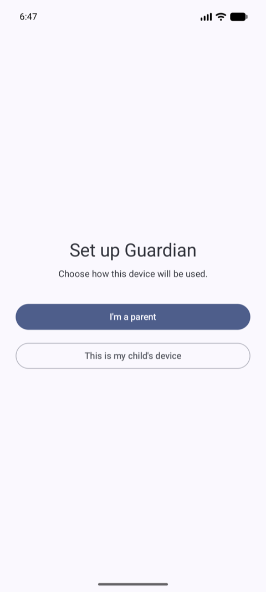
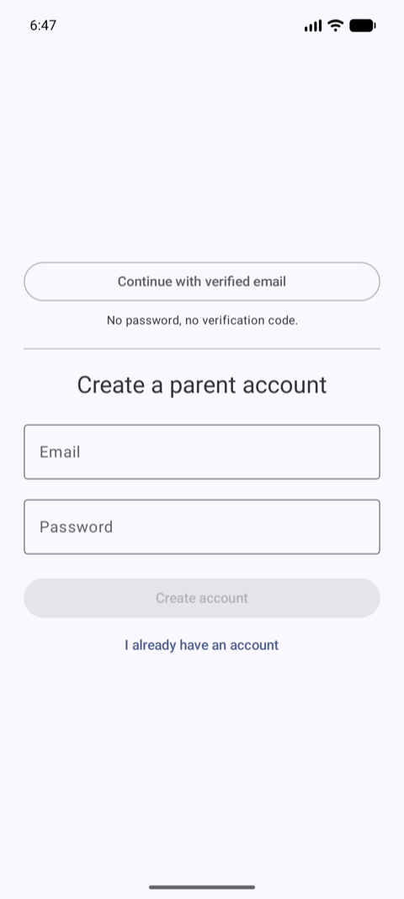
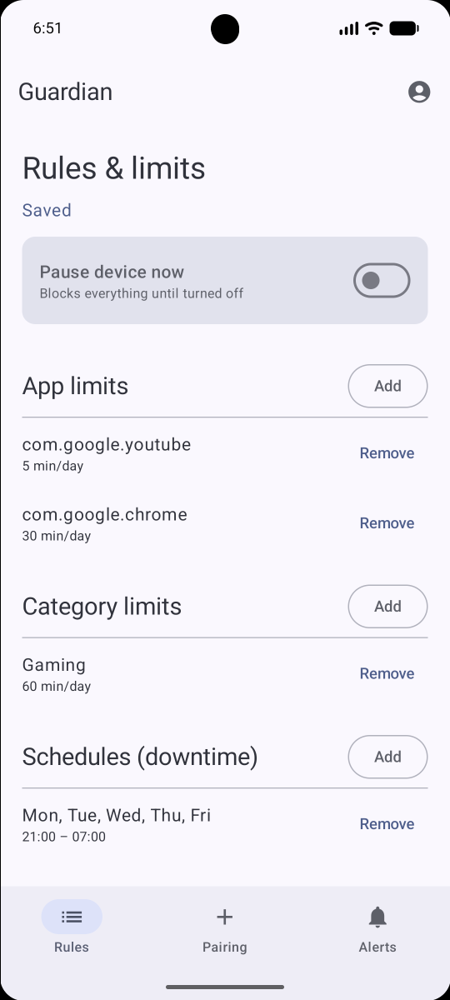
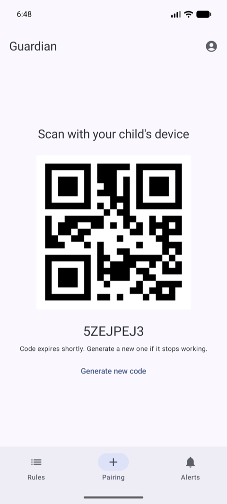
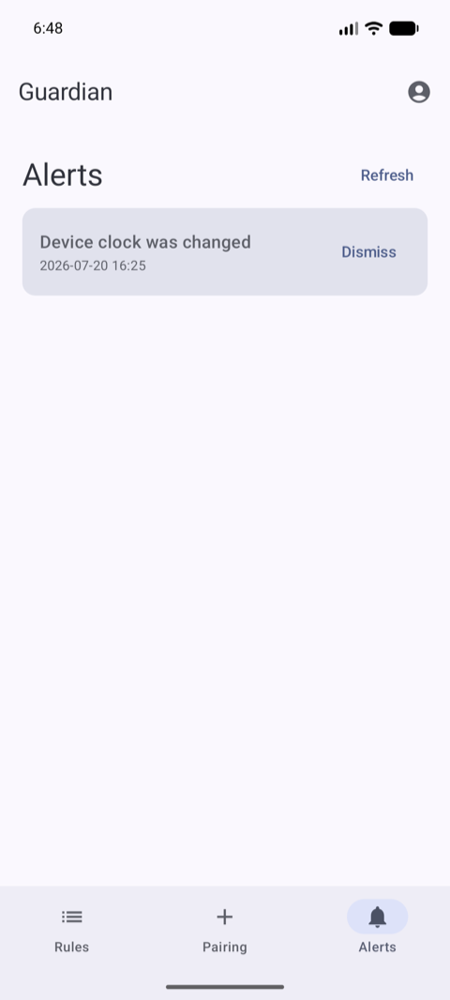
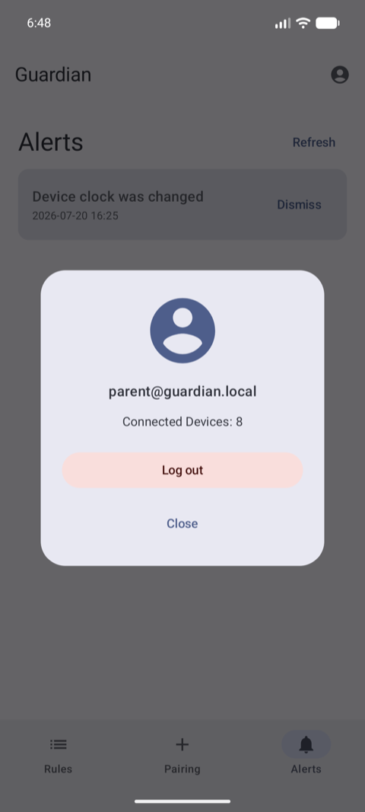
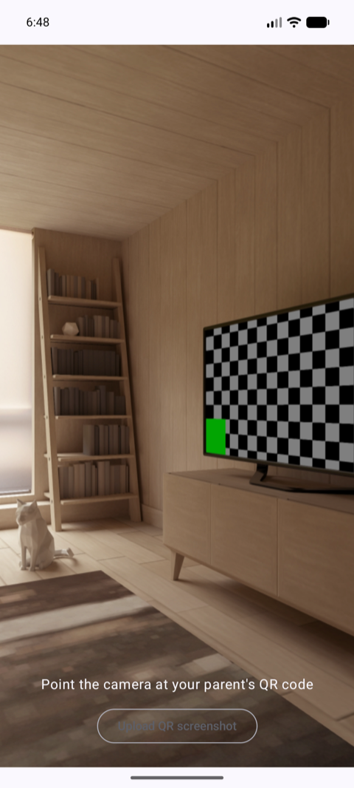
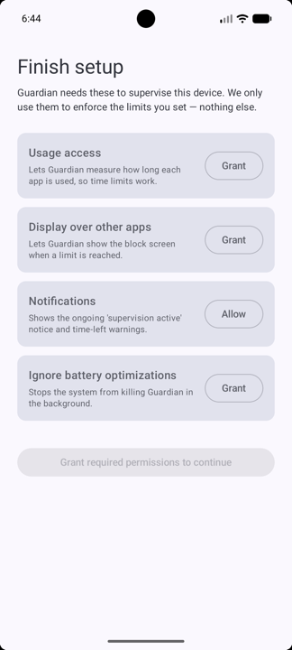

# Guardian

Android parental-control app. A **parent** device manages rules, limits and schedules; a **child**
device enforces them locally and reports tamper alerts. The two are linked by scanning a QR pairing
code.

Built with Jetpack Compose, Navigation 3, Koin, Ktor and Room, in a multi-module Kotlin codebase.

---

## Screenshots

### Parent

| Role selection                                                 | Sign in                                                     | Rules                                                           |
|----------------------------------------------------------------|-------------------------------------------------------------|-----------------------------------------------------------------|
|  |  |  |

| Pairing                                                           | Alerts                                                           | Account settings                                                 |
|-------------------------------------------------------------------|------------------------------------------------------------------|------------------------------------------------------------------|
|  |  |  |

### Child

| QR scanner                                                    | Permission funnel                                                 |
|---------------------------------------------------------------|-------------------------------------------------------------------|
|  |  |

---

## Features

**Parent**

- Sign in with email + password, or OTP-less **verified email** via Credential Manager's Digital
  Credentials API (API 28+, falls back to the password form below that).
- Dashboard with a three-tab bottom bar — Rules, Pairing, Alerts — each keeping its own back stack
  across configuration change and process death.
- Rules: pause the device, per-app and per-category daily limits, downtime schedules. Saves are
  version-checked, so a concurrent edit from another parent surfaces as a conflict rather than
  silently overwriting.
- Pairing: mint a short-lived QR code for the child device to scan.
- Alerts: view and acknowledge tamper reports (clock changes, admin deactivation).
- Account settings dialog: account email, connected device count, logout.
- The session survives restarts. An expired access token is refreshed silently; only a failed
  refresh or an explicit logout returns to role selection.

**Child**

- Pair by scanning the parent's QR, or by importing a screenshot of it from the photo picker.
- Guided permission funnel with prominent disclosure before each system prompt: usage access,
  overlay, notifications, battery exemption, plus OEM auto-start guidance where relevant.
- Always-on foreground service enforces limits, with a block overlay, boot/watchdog resurrection and
  offline policy caching. Policy documents are signature-verified before being applied.

---

## Prerequisites

You need **three files that are not in version control**, plus five values in `local.properties`.

### 1. `app/google-services.json`

Firebase config for FCM. Create a Firebase project, register an Android app with the applicationId
`com.shdev.guardian`, and download the file into `app/`.

> Firebase does **not** auto-initialize in this app — `FirebaseInitProvider` is removed from the
> manifest. It is initialized programmatically: at the start of the child pairing flow, and on cold
> start for devices that have already paired.

### 2. `app/kotzilla.json`

[Kotzilla](https://kotzilla.io) SDK config (Koin performance monitoring). Setup SDK
following [oficcial docs](https://doc.kotzilla.io/docs/getstartedCustom/overview).

To build without Kotzilla instead, set `enabled = false` in the `kotzilla { }` block of each
module's
`build.gradle.kts`.

### 3. `app/release.jks`

Release signing keystore. Only needed for `assembleRelease`; debug builds use the standard debug
key.

```bash
keytool -genkeypair -v -keystore app/release.jks \
  -keyalg RSA -keysize 2048 -validity 10000 -alias <your-alias>
```

### 4. `local.properties`

Not in version control. `sdk.dir` is written automatically by Android Studio; add the rest yourself:

```properties
sdk.dir=/path/to/Android/sdk

# Release signing — consumed by app/build.gradle.kts
keyAlias=<keystore alias>
keyPassword=<key password>
storeFile=release.jks
storePassword=<keystore password>

# Backend base URL — exposed to the app as data.BuildConfig.BASE_URL
baseUrl=http://192.168.1.7:8080
```

`storeFile` is resolved relative to the `app/` module.

---

## Build & run

```bash
./gradlew :app:assembleDebug          # debug APK
./gradlew :app:installDebug           # build + install on a connected device
./gradlew :app:assembleRelease        # minified, shrunk, signed with release.jks
./gradlew :core:policy:test           # unit tests
```

Requires JDK 17+ (Gradle toolchains resolve the rest via the foojay plugin). Gradle 9.6.1,
AGP 9.3.0, Kotlin 2.4.10, `compileSdk` 37, `minSdk` 26, `targetSdk` 36.

### Backend

The app talks to a Spring Boot backend at `baseUrl`, which is **not** part of this repository.
Without
it you can reach role selection and the child scanner, but not sign in or pair.

Endpoints used: `/auth/register`, `/auth/login`, `/auth/refresh`, `/devices`, `/devices/register`,
`/devices/fcm-token`, `/pairing/codes`, `/sync/policy`, `/alerts`.

Two endpoints for the verified-email flow are **not implemented server-side yet**, so that sign-in
path will fail against a real backend: `POST /auth/verified-email/challenge` and
`POST /auth/verified-email`. The checks the server owes before minting a session — issuer, SD-JWT
signature, key binding, nonce single-use, `email_verified` — are documented in
`VerifiedEmailApi`'s KDoc.

---

## Module structure

```
:app                      Composition root — Application, Activity, root navigation, Koin assembly
:core:policy              Pure-Kotlin policy evaluation engine (no Android deps, unit tested)
:core:navigation          Navigation 3 state holder + Navigator, shared by :app and feature modules
:data                     Repositories, Ktor clients, Room, encrypted DataStore, sync engine
:feature:parent:api       Parent route keys (public navigation contract)
:feature:parent:impl      Parent screens, ViewModels, DI
:feature:child:api        Child route keys
:feature:child:impl       Child screens + the enforcement runtime (service, overlay, receivers, FCM)
:macrobenchmark           Startup / navigation benchmarks and baseline profile generation
```

Feature modules are split `api` / `impl` so one feature can navigate to another without depending on
its implementation. Only `:app` is minified, so all R8 keep rules live in `app/proguard-rules.pro`.

---

## Architecture notes

- **Navigation 3** throughout. The root has one back stack per top-level flow (role selection, child
  home, parent dashboard); the dashboard nests its own display for the three tabs. Account settings
  is a `DialogSceneStrategy` scene.
- **Two Ktor clients per role.** A plain client handles calls that *mint* a session (login,
  register,
  refresh, pairing), and an authenticated client carries the bearer token and transparently
  refreshes
  it on 401. Keeping them separate is what stops the refresh path from recursing.
- **Encrypted at rest.** Auth tokens, device role and parent session live in `MultiProcessDataStore`
  instances whose serializer encrypts the whole document through the Android Keystore.
- **Session teardown is centralized.** `ParentSessionManager` and `DeviceSessionManager` own the
  only
  two ways a session ends — a failed token refresh, or explicit logout. A plain 401 is not one of
  them.

---

## Testing & benchmarks

```bash
./gradlew :core:policy:test                                     # policy engine unit tests
./gradlew :macrobenchmark:connectedBenchmarkReleaseAndroidTest  # startup + navigation, needs a device
./gradlew :app:generateBaselineProfile                          # regenerate the baseline profile
```

`RoleSelectionNavigationBenchmark` requires an install with **no persisted parent session** — once a
parent authenticates, the role is pinned and launch routes straight to the dashboard, so role
selection never appears and the benchmark times out. Clear app data before running it.

---

## Security notes

- `baseUrl` defaults to cleartext HTTP for local development. Anything on the same network can read
  the traffic, including bearer tokens. Move to HTTPS before shipping, and prefer a per-build-type
  `BuildConfig` value over a hardcoded LAN address.
- `kotzilla.json`, `google-services.json`, `release.jks` and `local.properties` are gitignored. Keep
  it that way — the first holds a live SDK key, the last holds your keystore passwords.
- Claims parsed from a verified-email credential on-device are display-only. Authentication is
  decided server-side against the raw presentation.

---

## License

```
Copyright 2026 NeroSH

Licensed under the Apache License, Version 2.0 (the "License");
you may not use this file except in compliance with the License.
You may obtain a copy of the License at

    http://www.apache.org/licenses/LICENSE-2.0

Unless required by applicable law or agreed to in writing, software
distributed under the License is distributed on an "AS IS" BASIS,
WITHOUT WARRANTIES OR CONDITIONS OF ANY KIND, either express or implied.
See the License for the specific language governing permissions and
limitations under the License.
```

See [LICENSE](LICENSE) for the full text.
